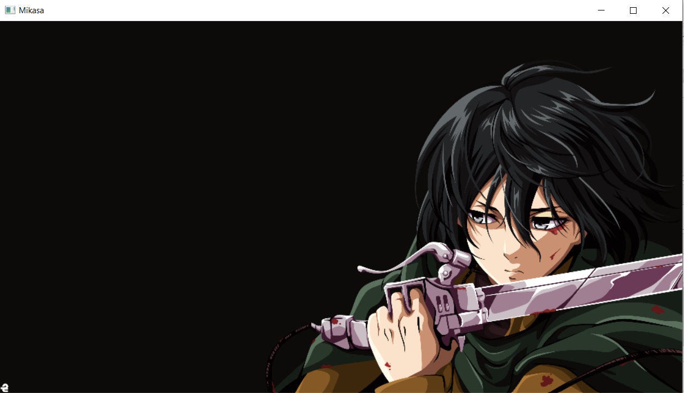
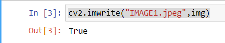
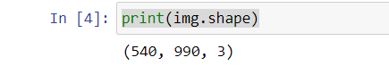
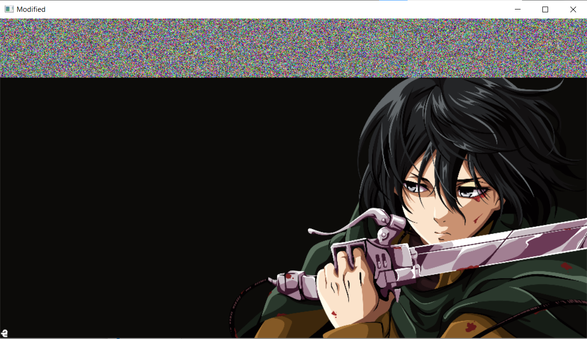
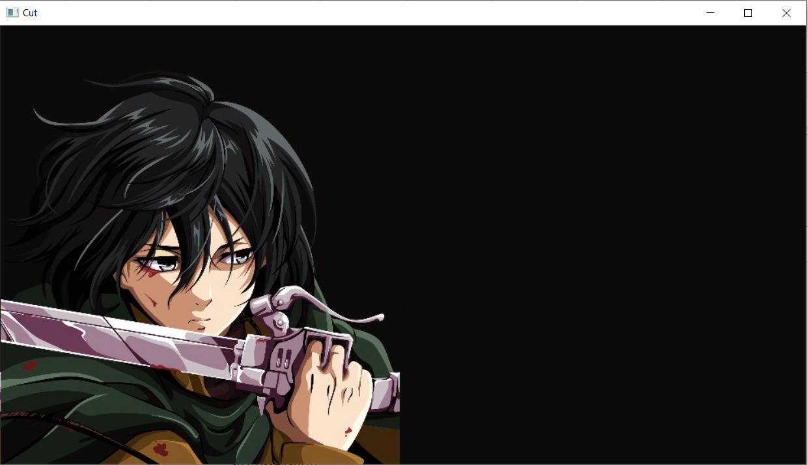

# READ AND WRITE AN IMAGE

## AIM

To write a python program using OpenCV to do the following image manipulations.
i) Read, display, and write an image.
ii) Access the rows and columns in an image.
iii) Cut and paste a small portion of the image.

## Software Required:

Anaconda - Python 3.7

## Algorithm:

### Step1:

Choose an image and save it as a filename.jpg

### Step2:

Use imread(filename, flags) to read the file.

### Step3:

Use imshow(window_name, image) to display the image.

### Step4:

Use imwrite(filename, image) to write the image.

### Step5:

End the program and close the output image windows.

## Program:

### Developed By: Pradeesh S

### Register Number: 212221240038

i) #To Read,display the image

```
import cv2
import numpy
img= cv2.imread('mikasa4k.png',1)
img=cv2.resize(img, (990,540))
cv2.imshow("Mikasa",img)
cv2.waitKey(0)

```

ii) #To write the image

```
cv2.imwrite("IMAGE1.jpeg",img)
```

iii) #Find the shape of the Image

```python3
print(img.shape)
```

iv) #To access rows and columns

```python3
import random
for i in range(0,100):
    for j in range(0,990):
        img[i][j]=[random.randint(0,255),random.randint(0,255),random.randint(0,255)]
cv2.imshow("Modified",img)
cv2.waitKey(0)
```

v) #To cut and paste portion of image

```python3
color_img = cv2.imread('IMAGE1.jpeg',1)
#color_img=cv2.resize(color_img, (990,540))
tag = color_img[0:540,500:990]
color_img[0:540,0:490] = tag
color_img[0:540,490:990]=11

cv2.imwrite("IMAGE2.jpeg",color_img)
color_img2= cv2.imread('IMAGE2.jpeg',1)

for i in range(0,490):
    for j in range(0,540):
        color_img2[j][490-i]=color_img[j][i]

cv2.imshow("Cut",color_img2)
cv2.waitKey(0)
```

## Output:

### i) Read and display the image


<br>
<br>

### ii)Write the image


<br>
<br>

### iii)Shape of the Image


<br>
<br>

### iv)Access rows and columns


<br>
<br>

### v)Cut and paste portion of image


<br>
<br>

## Result:

Thus the images are read, displayed, and written successfully using the python program.
